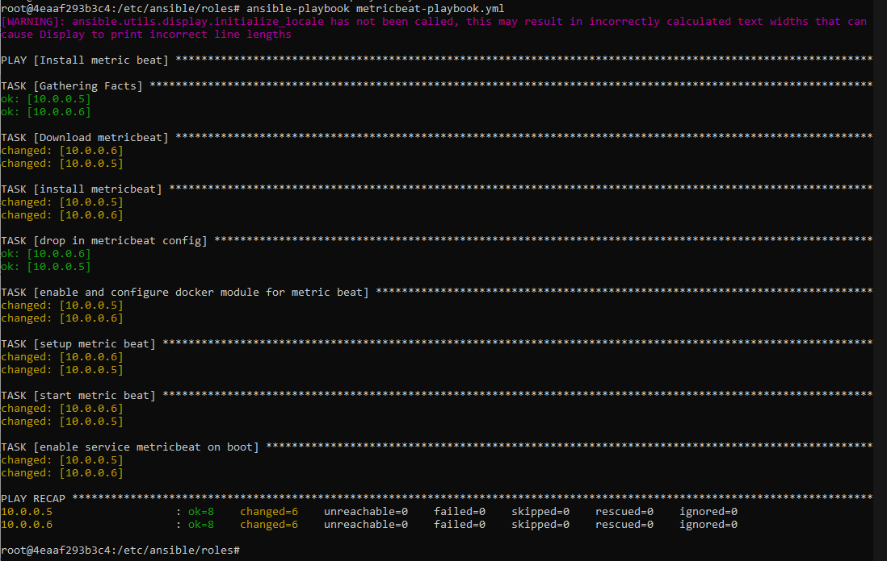

# ELK-Stack-Project
================
## Automated ELK Stack Deployment

The files in this repository were used to configure the network depicted below.

These files have been tested and used to generate a live ELK deployment on Azure. They can be used to either recreate the entire deployment pictured above. Alternatively, select portions of the YAML file may be used to install only certain pieces of it, such as Filebeat.

  - [Install ELK](/Ansible/Playbooks/install-elk.yml)
  - [Filebeat Playbook](/Ansible/Playbooks/filebeat-playbook.yml)
  - [Metricbeat Playbook](/Ansible/Playbooks/metricbeat-playbook.yml)

This document contains the following details:
- Description of the Topologu
- Access Policies
- ELK Configuration
  - Beats in Use
  - Machines Being Monitored
- How to Use the Ansible Build

### Description of the Topology

The main purpose of this network is to expose a load-balanced and monitored instance of DVWA, the D*mn Vulnerable Web Application.

Load balancing ensures that the application will be highly available, in addition to restricting restricting access to the network.

_What aspect of security do load balancers protect? What is the advantage of a jump box?_ 
- Load balancers ensure availability of servers and applications. The advantage of a jump box is ability to jump between servers without being 
  tied down to a specific Virtual Machine or server, it is versatile and allows for accessibility.

Integrating an ELK server allows users to easily monitor the vulnerable VMs for changes to the _____ and system _____.

_What does Filebeat watch for?_
- Filebeat monitors the log files that are specified, collects log events, and can forward them either to Elasticsearch or Logstash.

_What does Metricbeat record?_
- Metricbeat records the metrics and statistics from your servers, like CPU and memory usage, and outputs it to Elasticsearch or Logstash, similar to Filebeat.

The configuration details of each machine may be found below.
_Note: Use the [Markdown Table Generator](http://www.tablesgenerator.com/markdown_tables) to add/remove values from the table_.

| Name     | Function | IP Address | Operating System |
|----------|----------|------------|------------------|
| Jump Box | Gateway  | 10.0.0.4   | Linux            |
| Web-1    | Server   | 10.0.0.5   | Linux            |
| Web-2    | Server   | 10.0.0.6   | Linux            |
| ELK-Stack| Server   | 10.1.0.4   | Linux            |

### Access Policies

The machines on the internal network are not exposed to the public Internet. 

Only the ELK-Stack machine can accept connections from the Internet. Access to this machine is only allowed from the following IP address:
- _47.132.64.144_

Machines within the network can only be accessed by Jumpbox.

_Which machine did you allow to access your ELK VM? What was its IP address?_
- I allowed my PC to access the ELK VM and its IP is 47.132.64.144

A summary of the access policies in place can be found in the table below.

| Name     | Publicly Accessible | Allowed IP Addresses   |
|----------|---------------------|------------------------|
| Jump Box | No                  | 47.132.64.144          |
| Web-1    | No                  | 10.0.0.4               |
| Web-2    | No                  | 10.0.0.4               |
| Red-LB   | Yes                 | 20.228.187.131         |
| ELK-Stack| Yes                 | 47.132.64.144, 10.0.0.4|

### Elk Configuration

Ansible was used to automate configuration of the ELK machine. No configuration was performed manually, which is advantageous because...
_What is the main advantage of automating configuration with Ansible?_
- The main advantage of automating configuration with Ansible is how easily it can be recreated and used
  for future configuration. It also helps represent Infrastructure as Code (IAC) very well.

The playbook implements the following tasks:

- Install Docker which is the platform for containerization.
- Install Python3 pip to manage and install software packages.
- Increase virtual memory in order for ELK to properly run.
- Download and launch a docker ELK container.
- Run ELK on the specified ports 5601:5601

The following screenshot displays the result of running `docker ps` after successfully configuring the ELK instance.

### Target Machines & Beats
This ELK server is configured to monitor the following machines:

- Web-1: 10.0.0.5
- Web-2: 10.0.0.6

We have installed the following Beats on these machines:

- Filebeat
- Metricbeat 

These Beats allow us to collect the following information from each machine:

- Filebeat collects a lot of "log" type data. For instance, it can collect system logs, audit logs, deprecation logs and many more. The image below shows
  an example of what to expect when looking at system logs. This particular image shows details about Web-2 and gives messages on what was occuring.

- Metricbeat collects more "metric" type of data. This includes CPU usage, memory, and other data that has to do with different services running on the server(s).
  The image below shows what some of the metric data Metricbeat provides via CPU and Memory for both Web-1 and Web-2.

### Using the Playbook
In order to use the playbook, you will need to have an Ansible control node already configured. Assuming you have such a control node provisioned: 

SSH into the control node and follow the steps below:
- Copy the config file to Web-1 and Web-2 (Will be done in Playbook).
- Update the `hosts` file to include the (Webservers) and (elk).

- Run the playbook, and navigate to Kibana to check that the installation worked as expected.
 
- The images below should ensure all three playbooks were ran successfully and are ensured with Kibana:

_Which file is the playbook?

- filebeat-playbook.yml
- metricbeat-playbook.yml
 
_Where do you copy it?_

- Filebeat is copied from `/etc/ansible/files/filebeat-config.yml` to `/etc/filebeat/filebeat.yml`
- Metricbeat is copied from `/etc/ansible/files/metricbeat-config.yml` to `/etc/metricbeat/metricbeat.yml` 

_Which file do you update to make Ansible run the playbook on a specific machine? 

- You must update the `hosts` file as shown above. Specifying the IP addresses under either (Webservers) or (elk)
  will allow Ansible to determine which machine(s) to run on. Following this you should update your playbooks.
  
_How do I specify which machine to install the ELK server on versus which to install Filebeat on?_

- After adjusting your `hosts` file and having created (Webservers) and (elk) to specify certain IP addresses
  belong. Now at the top of your install-elk.yml playbook where it says hosts you should list (elk) to designate that machine.
  Whereas on the filebeat-playbook.yml where it says hosts, you should list (Webservers) so that the playbook deploys to Web-1 and Web-2.

_Which URL do you navigate to in order to check that the ELK server is running?

- You need to navigate to http://[Your-ELK-Public-IP]:5601/app/kibana 
- If successful it will show this:
  
